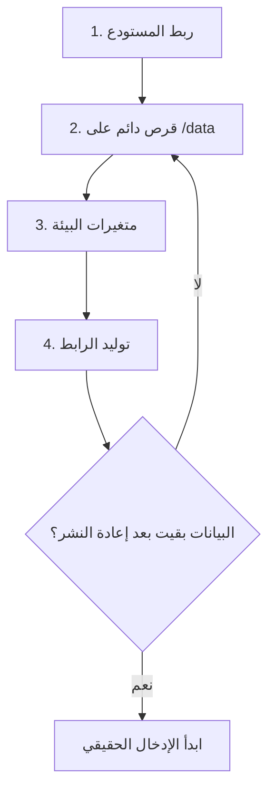

[English](../README.md) · **العربية**

<div align="center">


</div>

# 🚀 نشر منصة النتائج على Railway

دليل لمسؤول حاسوب المدرسة، لا يفترض خبرة سابقة بالنشر السحابي. التشغيل المحلي على حاسوب المدرسة يبقى شغّالاً كما هو (راجع `README.md`).

لوحة Railway كلها بالإنجليزية، فنذكر نص كل زر كما يظهر على الشاشة.

---

## 🗺️ الطريق من البداية للنهاية



الترتيب مقصود. القرص والمتغيرات قبل أي بيانات حقيقية.

---

## 💰 الكلفة

| البند | الكلفة |
|---|---|
| رصيد تجريبي لمرة واحدة | 5 دولارات، بلا بطاقة ائتمانية |
| خطة Hobby للتشغيل الدائم | 5 دولارات شهرياً، تشمل رصيد استهلاك |
| استهلاك هذا التطبيق | خدمة صغيرة وقرص أقل من غيغابايت |

الأسعار تتغير؛ راجع `railway.com/pricing` قبل الاشتراك. الدفع والاشتراك قرار إداري ينفّذه مسؤول المدرسة بنفسه.

---

## ⛔ قاعدتان قبل كل شيء

> [!CAUTION]
> **القرص الدائم.** Railway تبني التطبيق من الصفر عند كل نشر وتمسح كل ما كُتب على قرصه المؤقت. بدون قرص دائم على `/data` ومتغير `DB_PATH=/data/grades.sqlite`، أول تحديث يمسح كل الدرجات والطلبة والأقسام.

> [!WARNING]
> **نسخة واحدة فقط.** قاعدة SQLite ملف واحد. نسختان تكتبان عليه معاً تفسدانه. ملف `railway.json` يضبط `numReplicas: 1` تلقائياً، فلا ترفع العدد من إعدادات الخدمة. لو ظهرت رسالة عن تعارض بين Replicas والقرص، الحل هو البقاء على نسخة واحدة، لا إزالة القرص.

---

## ✅ قبل أن تبدأ

- **حساب GitHub** باسم المدرسة، فيه المستودع بأحدث نسخة من الكود، و**خاص (Private)**.
- **لا ملفات قاعدة بيانات ولا كلمات سر في المستودع.** ملف `.gitignore` يستثني `data/` و `*.sqlite` و `.env` و `backups/` — اتركه يشتغل ولا تضف هذه الملفات يدوياً.
- **حساب Railway**: من `railway.com` اضغط "Login" ثم "Login with GitHub". استخدام حساب GitHub نفسه يسهّل ربط المستودع بعد قليل.

---

## 🔑 متغيرات البيئة

تُضبط من تبويب "Variables" في صفحة الخدمة (الخطوة 3 أدناه). هذا مرجعها:

| المتغير | القيمة | إلزامي | ماذا يفعل |
|---|---|:---:|---|
| `DB_PATH` | `/data/grades.sqlite` | ✅ | مسار القاعدة على القرص الدائم. بدونه تُكتب على القرص المؤقت وتضيع. |
| `SESSION_SECRET` | نص عشوائي طويل | ✅ | مفتاح توقيع الجلسات. لو تُرك فارغاً يتولّد مفتاح جديد كل تشغيل ويخرج المدير من حسابه. اضبطه مرة واحدة ولا تغيّره. |
| `NODE_ENV` | `production` | ✅ | يفعّل وضع الإنتاج، ومنه قصر ملف الجلسة على HTTPS. |
| `ADMIN_USER` | اسم مستخدم المدير | ➖ | يُطبَّق عند أول تشغيل فقط. الافتراضي `admin`. |
| `ADMIN_PASS` | كلمة سر أولية | ➖ | أول تشغيل فقط. غيّرها من داخل اللوحة على كل حال. |
| `PORT` | — | 🚫 | لا تضبطه. Railway توفّره والتطبيق يقرؤه. |

لتوليد `SESSION_SECRET`، نفّذ على أي جهاز فيه Node وانسخ الناتج:

```bash
node -e "console.log(require('crypto').randomBytes(32).toString('hex'))"
```

مكانه الوحيد تبويب "Variables". لا يدخل ملفاً في المستودع ولا رسالة محادثة.

---

## 📦 خطوات النشر

### 1. أنشئ المشروع من المستودع

من لوحة Railway: "New Project" ← "Deploy from GitHub repo". لو طُلبت الصلاحية، اضغط "Configure GitHub App" واسمح بالوصول إلى مستودع المنصة وحده، ثم اختره من القائمة.

سيبدأ أول بناء تلقائياً، لكن المنصة ليست جاهزة بعد — أكمل الخطوتين 2 و3.

Railway تقرأ `railway.json` من المستودع (أمر التشغيل، فحص الصحة على `/api/health`، إعادة التشغيل عند الفشل، نسخة واحدة)، وتقرأ `.node-version` لتثبيت Node 22.

### 2. أرفق القرص الدائم

انقر بالزر الأيمن على بطاقة الخدمة ← "Attach Volume". أو: "Create" ← "Volume" ← اختر الخدمة.

في خانة "Mount Path" اكتب بالضبط:

```
/data
```

أكّد، وستظهر أيقونة القرص مرتبطة بالخدمة.

<!-- ضع تسجيل شاشة قصيراً هنا ليرى المسؤول الخطوة بعينه:
 -->

### 3. اضبط المتغيرات

افتح الخدمة ← تبويب "Variables" ← "New Variable". أضف الثلاثة الإلزامية من الجدول أعلاه، وأضف `ADMIN_USER` و `ADMIN_PASS` لو أردت تحديد حساب المدير الأول.

بعد الحفظ ستعرض Railway إعادة نشر لتطبيق المتغيرات. اقبل.

### 4. ولّد الرابط العام

"Settings" ← "Networking" ← "Generate Domain". يظهر رابط مثل `https://rafidain.up.railway.app`.

<details>
<summary>🌐 لربط نطاق خاص بالمدرسة</summary>

من القسم نفسه اضغط "Custom Domain" واتبع تعليمات سجل DNS التي تعرضها الشاشة. تحتاج صلاحية تعديل نطاق المدرسة عند مزوّد النطاق.

</details>

### 5. انتظر اكتمال النشر

من تبويب "Deployments" راقب أحدث عملية. تمر بمرحلتي "Building" ثم "Deploying"، ولا تُعلن ناجحة إلا بعد نجاح فحص `/api/health`. عند ظهور "Active" صار الموقع شغّالاً.

لو فشلت، افتح "Build Logs" أو "Deploy Logs" وانزل إلى قسم استكشاف الأخطاء.

---

## 🧪 قائمة التحقق بعد أول نشر

نفّذها بالترتيب قبل إدخال أي بيانات حقيقية.

- [ ] **فحص الصحة** — افتح `https://رابطك/api/health`، يجب أن ترى `{"ok":true}`
- [ ] **صفحة الطالب** — الرابط الرئيس يفتح واجهة الاستعلام بالعربية وبالخط الصحيح
- [ ] **دخول المدير** — `https://رابطك/admin-login.html`
- [ ] **غيّر كلمة السر فوراً** — كلمة السر الافتراضية على رابط عام تعني أن أي شخص يتحكم بالدرجات. التطبيق يطبع تحذيراً في السجلات ما دامت مستخدمة
- [ ] **بيانات تجريبية** — أنشئ قسماً ومرحلة وشعبة وطالباً واحداً، أدخل له درجة، ثم استعلم عنه من صفحة الطالب
- [ ] **اختبار البقاء** — من "Deployments"، قائمة النقاط الثلاث ← "Redeploy". بعدها يجب أن يبقى الطالب التجريبي ودرجته، وأن تبقى جلسة المدير مفتوحة بلا إعادة دخول
- [ ] **فعّل النسخ الاحتياطي الدوري** (الفقرة أ أدناه)
- [ ] **احذف البيانات التجريبية** وابدأ الإدخال الحقيقي

> [!IMPORTANT]
> لو اختفت البيانات في اختبار البقاء، فالقرص غير مركّب أو `DB_PATH` مكتوب خطأ. أصلحه وأعد الاختبار قبل أي بيانات حقيقية.

---

## 💾 النسخ الاحتياطي

اعتمد الاثنين: الأول شبكة أمان على مستوى المنصة، والثاني ملف تحتفظ به خارج Railway.

### (أ) نسخ القرص الدوري من اللوحة

افتح الخدمة ← تبويب "Backups". فعّل جدولة يومية على الأقل. المنصة تحتفظ باليومية 6 أيام، والأسبوعية شهراً، والشهرية ثلاثة أشهر، ويمكن تفعيلها معاً. كلفة التخزين لقاعدة بهذا الحجم زهيدة.

للاستعادة: اختر النسخة بتاريخها ← "Restore" ← راجع التغييرات ← "Deploy".

خذ نسخة يدوية من التبويب نفسه قبل أي عملية كبيرة: استيراد درجات، حذف واسع، تحديث كبير.

### (ب) سكربت النسخ المرفق

`scripts/backup.js` يأخذ لقطة متّسقة عبر واجهة النسخ الرسمية في SQLite، فيشتغل بأمان والخادم يعمل. لا تنسخ ملف القاعدة بـ `cp` وهو قيد التشغيل. بعد النسخ يتحقق السكربت من سلامة الملف ويطبع عدد الصفوف في كل جدول.

**محلياً:**

```bash
npm run backup
```

يقرأ من `DB_PATH` أو من `data/grades.sqlite`، ويكتب في `backups/grades-backup-التاريخ-الوقت.sqlite`. أي فشل يعيد رمز خروج غير صفري ويحذف الملف الناقص.

**على Railway:** ثبّت الأداة مرة واحدة على حاسوبك، ثم اربط المشروع من مجلده:

```bash
npm i -g @railway/cli
railway login
railway link
```

بعدها افتح جلسة داخل الخادم ونفّذ النسخ إلى القرص الدائم:

```bash
railway ssh
BACKUP_DIR=/data/backups npm run backup
```

<details>
<summary>⬇️ تنزيل النسخة إلى حاسوب المدرسة</summary>

حوّل الملف إلى ترميز نصي داخل الخادم وأعده ملفاً عندك. لو كانت نسخة الأداة تدعم تمرير أمر مباشرة:

```bash
railway ssh "base64 /data/backups/اسم-الملف.sqlite" > backup.b64
```

ثم فك الترميز محلياً:

```bash
# Windows
certutil -decode backup.b64 backup.sqlite

# Linux / macOS
base64 -d backup.b64 > backup.sqlite
```

لو لم تدعم أداتك هذه الصيغة، اعتمد نسخ اللوحة الدورية أساساً ونفّذ السكربت على النسخة المحلية.

</details>

---

## 🔄 الاستعادة من ملف

على الوضع المحلي:

1. أوقف الخادم (`Ctrl+C`).
2. انسخ ملف النسخة فوق `data/grades.sqlite`.
3. احذف `data/grades.sqlite-wal` و `data/grades.sqlite-shm` لو كانا موجودين. بقاؤهما بجانب ملف مستعاد يفسد البيانات.
4. شغّل `npm start` واستعلم عن طالب معروف للتأكد.

على Railway، الطريق الأول هو لوحة "Backups". ولو اضطررت للاستعادة من ملف خارجي: أعلن توقفاً قصيراً عن الاستخدام، ارفع الملف إلى `/data` بعكس أسلوب الترميز أعلاه، ثم داخل `railway ssh` بدّل الملف واحذف الملفين الجانبيين كما في الخطوتين 2 و3 (المسارات تبدأ بـ `/data/`)، ثم "Deployments" ← "Restart".

**روتين مقترح للمدرسة:** نسخ يومي تلقائي طوال موسم إدخال الدرجات، ونسخة عبر السكربت قبل وبعد كل إدخال جماعي كبير تُحفظ على جهاز المدرسة وقرص خارجي، وتجربة استعادة فعلية مرة كل فصل على نسخة محلية لا على الموقع الحي. النسخة التي لم تُجرَّب استعادتها ليست نسخة.

---

## ⬆️ التحديث لاحقاً

ادفع التعديلات إلى فرع النشر (`git push`)، وتتولى Railway البناء والنشر. الرابط لا يتحول إلى النسخة الجديدة إلا بعد نجاح فحص الصحة.

البيانات في أمان لأنها على القرص الدائم، وجلسة المدير لا تنقطع ما دام `SESSION_SECRET` كما هو. قبل التحديثات الكبيرة، خذ نسخة يدوية من "Backups".

---

## 🩺 استكشاف الأخطاء

<details>
<summary><b>فشل البناء والسجل يذكر <code>better-sqlite3</code> أو <code>node-gyp</code></b></summary>

البناء يستخدم إصدار Node غير مناسب. تأكد أن ملف `.node-version` وفيه `22` موجود في جذر المستودع ومدفوع إلى GitHub، ثم أعد النشر. لو تكرر، افتح "Build Logs" وابحث عن سطر إصدار Node.

</details>

<details>
<summary><b>النشر يفشل عند "Healthcheck"</b></summary>

التطبيق لم يقلع أو أخفق فحص `/api/health`. افتح "Deploy Logs". الأشيع سببان: ضبط `PORT` يدوياً (احذفه)، أو `DB_PATH` يشير إلى مجلد غير موجود (يجب أن يكون على `/data` والقرص مركّب).

</details>

<details>
<summary><b>البيانات اختفت بعد إعادة النشر</b></summary>

القرص غير مركّب على `/data`، أو `DB_PATH` غير مضبوط أو مكتوب خطأ. راجع الخطوتين 2 و3 وأعد اختبار البقاء. ما مُسح قبل تركيب القرص لا يعود إلا من نسخة احتياطية.

</details>

<details>
<summary><b>المدير يُخرَج من حسابه بعد كل نشر</b></summary>

`SESSION_SECRET` غير مضبوط فيتولّد مفتاح جديد كل مرة، أو أحدهم غيّره. اضبطه مرة واحدة في "Variables" واتركه.

</details>

<details>
<summary><b>تسجيل الدخول يُرفض رغم صحة كلمة السر</b></summary>

فتحت اللوحة عبر `http://` لا `https://` مع `NODE_ENV=production`، وملف الجلسة مقصور على HTTPS. استخدم رابط `https://` دائماً؛ روابط Railway المولّدة كذلك أصلاً.

</details>

<details>
<summary><b>رسالة 429 «محاولات كثيرة»</b></summary>

حد المحاولات الفاشلة: 10 خلال 15 دقيقة. انتظر ربع ساعة ثم أعد المحاولة بكلمة السر الصحيحة. المحاولات الناجحة لا تُحتسب.

</details>

<details>
<summary><b>رسالة عن تعارض بين "Replicas" و"Volume"</b></summary>

محاولة تشغيل أكثر من نسخة مع قرص تخزين. القاعدة: نسخة واحدة دائماً. لا تُزل القرص.

</details>

<details>
<summary><b>تحذير في السجلات عن كلمة مرور المدير الافتراضية</b></summary>

ما زالت `rafidain@2026` مستخدمة. غيّرها من اللوحة الآن.

</details>

<details>
<summary><b>الموقع توقف فجأة</b></summary>

على الأرجح نفد الرصيد التجريبي (5 دولارات لمرة واحدة). الترقية إلى Hobby من صفحة الفوترة، ويتولاها مسؤول المدرسة.

</details>

---

## 📌 بطاقة سريعة

| | |
|---|---|
| 🗄️ القرص | `/data` + `DB_PATH=/data/grades.sqlite`، واختبار البقاء ناجح |
| 1️⃣ النسخ | واحدة دائماً، لا Replicas مع SQLite |
| 🔐 المفتاح | `SESSION_SECRET` يُضبط مرة، لا يُشارك، لا يدخل المستودع |
| 🔑 كلمة السر | تُغيَّر عند أول دخول |
| 💾 النسخ الاحتياطي | جدولة يومية + نسخة خارجية في موسم الدرجات + تجربة استعادة كل فصل |
| 🙈 المستودع | خاص، وبلا ملفات قاعدة أو `.env` |
