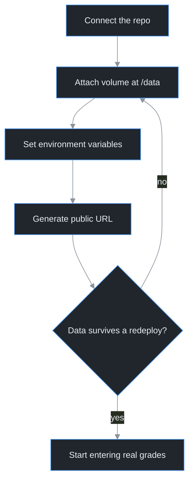

<div align="center">


# Deployment Guide

**Results Portal — Al-Rafidain Vocational Preparatory School**

**English** · [العربية](deployment.ar.md)


</div>

---

Written for the school's IT staff. No cloud experience assumed. Running the portal locally on a school machine still works exactly as before — see [`README.md`](../README.md).

The Railway dashboard is in English, so button names below match what's on screen.

<details>
<summary> <b>Done this before? The 60-second version</b></summary>

<br>

1. New Project → Deploy from GitHub repo
2. Attach a Volume at `/data` — **before** anything else
3. Variables: `DB_PATH=/data/grades.sqlite`, `SESSION_SECRET=<random hex>`, `NODE_ENV=production`
4. Settings → Networking → Generate Domain
5. Redeploy once and confirm the test data survives

Never raise the replica count. Never set `PORT`.

</details>

---

##  The order matters



The volume and the variables come before any real data. That is the whole guide in one picture.

---

##  Cost

| Item | Cost |
|---|---|
| One-time free trial | $5 credit, no card required |
| Hobby plan (needed to stay online) | $5/month, includes usage credit |
| What this app actually uses | One small service, volume well under 1 GB |

Prices change — check `railway.com/pricing` before subscribing. Payment and plan selection are an administrative decision, made and executed by school management.

---

##  Two rules that break everything

> [!CAUTION]
> **The volume is not optional.** Railway rebuilds the app from scratch on every deploy and wipes its temporary disk. Without a persistent volume at `/data` and `DB_PATH=/data/grades.sqlite`, the next update erases every grade, student, and department.

> [!WARNING]
> **One replica, always.** SQLite is a single file. Two instances writing to it will corrupt it. `railway.json` pins `numReplicas: 1` — leave it alone. If Railway warns about a conflict between replicas and volumes, the fix is staying at one replica, never removing the volume.

---

##  Before you start

- A **GitHub account owned by the school**, holding the repo with the current code, set to **Private**.
- **No database files or secrets in the repo.** `.gitignore` already excludes `data/`, `*.sqlite`, `.env`, and `backups/`. Don't force-add them.
- A **Railway account**: at `railway.com`, click "Login" → "Login with GitHub". Using the same GitHub account makes the next step one click.

<details>
<summary> <b>What Railway reads from the repo</b></summary>

<br>

| File | Purpose |
|---|---|
| `railway.json` | Start command, health check path `/api/health`, restart-on-failure, `numReplicas: 1` |
| `.node-version` | Pins Node 22 at build time |
| `.gitignore` | Keeps the database and secrets out of git |

All three must be committed and pushed. A missing `.node-version` is the most common build failure.

</details>

---

##  Environment variables

Set these in the service's "Variables" tab (step 3 below).

| Variable | Value | | What it does |
|---|---|:--:|---|
| `DB_PATH` | `/data/grades.sqlite` |  | Points the database at the persistent volume. Without it, data is written to the temporary disk and lost. |
| `SESSION_SECRET` | long random string |  | Signs login sessions. Leave it unset and a new key is generated every boot, logging the admin out after each deploy. Set once, never change. |
| `NODE_ENV` | `production` |  | Enables production mode, including HTTPS-only session cookies. |
| `ADMIN_USER` | admin username |  | First boot only. Defaults to `admin`. |
| `ADMIN_PASS` | strong initial password |  | First boot only. Change it from the dashboard regardless. |
| `PORT` | — |  | Railway provides it; the app reads it. Setting it manually breaks the health check. |

Generate the secret on any machine with Node and copy the output:

```bash
node -e "console.log(require('crypto').randomBytes(32).toString('hex'))"
```

Its only home is the "Variables" tab. Not a file in the repo, not a chat message.

---

##  Deploy

### 1. Create the project

"New Project" → "Deploy from GitHub repo". If Railway asks for access, click "Configure GitHub App" and grant it to this repo only, then pick it from the list.

The first build starts on its own, but **the portal is not ready yet** — steps 2 and 3 come first.

### 2. Attach the volume

Right-click the service card → "Attach Volume". (Or: "Create" → "Volume" → pick the service.)

When it asks for "Mount Path", type exactly:

```
/data
```

Confirm. A volume icon appears on the service.

<!-- Drop a short screen recording here — this is the step that causes data loss:
 -->

### 3. Set the variables

Open the service → "Variables" → "New Variable". Add the three required ones from the table above, plus `ADMIN_USER` and `ADMIN_PASS` if you want to pick the first admin account.

Railway will offer a redeploy to apply them. Accept it.

### 4. Generate the public URL

"Settings" → "Networking" → "Generate Domain". You get something like `https://rafidain.up.railway.app`.

<details>
<summary> <b>Using a school domain instead</b></summary>

<br>

Same section, "Custom Domain". Follow the DNS record instructions on screen. You'll need edit access to the school's domain at its registrar.

</details>

### 5. Wait for it to go live

Watch the newest entry under "Deployments". It moves through "Building" then "Deploying", and only succeeds after `/api/health` responds. Status "Active" means the site is up.

If it fails, open "Build Logs" or "Deploy Logs" and jump to [troubleshooting](#troubleshooting).

---

##  First-deploy checklist

Run all of it, in order, before entering real data.

- [ ] **Health check** — open `https://your-url/api/health`, expect `{"ok":true}`
- [ ] **Student page** — the root URL loads the lookup form in Arabic with the right font
- [ ] **Admin login** — `https://your-url/admin-login.html`
- [ ] **Change the password immediately** — a default password on a public URL means anyone can edit grades. The app logs a warning for as long as it's in use
- [ ] **Seed test data** — create one department, stage, section, and student, enter a grade, then look it up from the student page
- [ ] **Survival test** — "Deployments" → ⋯ → "Redeploy". Afterwards the test student and grade must still be there, and the admin session must still be valid without logging in again
- [ ] **Turn on scheduled backups** (see below)
- [ ] **Delete the test data** and start real entry

> [!IMPORTANT]
> If the data vanishes during the survival test, the volume isn't mounted or `DB_PATH` is wrong. Fix it and run the test again before any real grades go in.

---

##  Backups

Use both layers. The first is a platform safety net; the second is a file you keep outside Railway.

### Layer 1 — Railway's scheduled volume backups

Service → "Backups" tab. Enable at least a daily schedule. Railway keeps dailies for 6 days, weeklies for a month, monthlies for three months, and the schedules can run together. Storage for a database this size costs very little.

To restore: pick a snapshot by date → "Restore" → review the diff → "Deploy".

Take a manual snapshot from the same tab before anything large — a bulk grade import, a mass delete, a major update.

### Layer 2 — the bundled backup script

`scripts/backup.js` uses SQLite's official backup API, so it produces a consistent snapshot even while the server is running. Never `cp` a live database file. Afterwards it verifies the copy and prints a row count per table.

**Locally:**

```bash
npm run backup
```

Reads from `DB_PATH`, or `data/grades.sqlite` by default, and writes `backups/grades-backup-<date>-<time>.sqlite`. Any failure exits non-zero and deletes the partial file.

**On Railway** — install the CLI once and link the project from its folder:

```bash
npm i -g @railway/cli
railway login
railway link
```

Then open a shell on the server and write the snapshot to the persistent volume:

```bash
railway ssh
BACKUP_DIR=/data/backups npm run backup
```

<details>
<summary> <b>Pulling a snapshot down to a school machine</b></summary>

<br>

Encode it as text on the server, then decode it locally. If your CLI version accepts an inline command:

```bash
railway ssh "base64 /data/backups/<filename>.sqlite" > backup.b64
```

Then decode:

```bash
# Windows
certutil -decode backup.b64 backup.sqlite

# Linux / macOS
base64 -d backup.b64 > backup.sqlite
```

If your CLI doesn't support inline commands, treat Railway's scheduled backups as the primary copy and run the script against a local database instead.

</details>

---

##  Restoring from a file

Locally:

1. Stop the server (`Ctrl+C`).
2. Copy the backup over `data/grades.sqlite`.
3. Delete `data/grades.sqlite-wal` and `data/grades.sqlite-shm` if they exist. Leaving them next to a restored file will corrupt it.
4. Run `npm start` and look up a student you know to confirm.

On Railway, the "Backups" tab is the first option. If you must restore from an external file: announce a short outage, upload the file to `/data` (reverse the encoding above), then inside `railway ssh` swap the file and delete the two sidecar files as in steps 2–3 — paths start with `/data/` — then "Deployments" → "Restart".

### Suggested routine

| When | What |
|---|---|
| Every day during grade entry | Railway's automatic daily snapshot |
| Before and after a bulk import | Run the script, download it, keep a copy on a school machine and an external drive |
| Once per term | A real restore drill, on a local copy — never against the live site |

A backup you've never restored isn't a backup.

---

##  Updating later

Push to the deploy branch and Railway builds and ships it. Traffic only moves to the new version after the health check passes.

Data is safe on the volume, and admin sessions survive as long as `SESSION_SECRET` is unchanged. Before a large update, take a manual snapshot from "Backups".

---

<a name="troubleshooting"></a>

##  Troubleshooting

<details>
<summary> <b>Build fails, logs mention <code>better-sqlite3</code> or <code>node-gyp</code></b></summary>

<br>

The build is on the wrong Node version. Confirm `.node-version` containing `22` is in the repo root and pushed, then redeploy. If it repeats, open "Build Logs" and find the Node version line.

</details>

<details>
<summary> <b>Deploy fails at "Healthcheck"</b></summary>

<br>

The app didn't boot, or `/api/health` didn't answer. Open "Deploy Logs". Two usual causes: `PORT` was set manually (delete it), or `DB_PATH` points somewhere that doesn't exist (it must be under `/data`, with the volume attached).

</details>

<details>
<summary> <b>Data disappeared after a redeploy</b></summary>

<br>

The volume isn't mounted at `/data`, or `DB_PATH` is unset or misspelled. Recheck steps 2 and 3, then rerun the survival test. Anything deleted before the volume existed only comes back from a backup.

</details>

<details>
<summary> <b>Admin gets logged out after every deploy</b></summary>

<br>

`SESSION_SECRET` is unset, so a new key is generated each boot — or someone changed it. Set it once in "Variables" and leave it.

</details>

<details>
<summary> <b>Login rejected even with the correct password</b></summary>

<br>

You opened the dashboard over `http://` instead of `https://` while `NODE_ENV=production`, and the session cookie is HTTPS-only. Always use the `https://` link — Railway's generated domains already are.

</details>

<details>
<summary> <b>429 "too many attempts"</b></summary>

<br>

The limit is 10 failed logins in 15 minutes. Wait it out, then use the correct password. Successful logins don't count.

</details>

<details>
<summary> <b>Warning about "Replicas" conflicting with "Volume"</b></summary>

<br>

Something tried to run more than one instance alongside the volume. One replica, always. Don't remove the volume.

</details>

<details>
<summary> <b>Log warning about the default admin password</b></summary>

<br>

`rafidain@2026` is still in use. Change it from the dashboard now.

</details>

<details>
<summary> <b>Site went down with no warning</b></summary>

<br>

Most likely the one-time $5 trial credit ran out. Upgrading to Hobby happens on the billing page, and it's management's call.

</details>

---

##  Quick card

| | |
|---|---|
|  **Volume** | `/data` + `DB_PATH=/data/grades.sqlite`, survival test passed |
|  **Replicas** | One. Always. Never with SQLite. |
|  **Secret** | `SESSION_SECRET` set once, never shared, never committed |
|  **Password** | Changed at first login |
|  **Backups** | Daily schedule on, external copy during grade season, restore drill each term |
|  **Repo** | Private, no database files, no `.env` |
